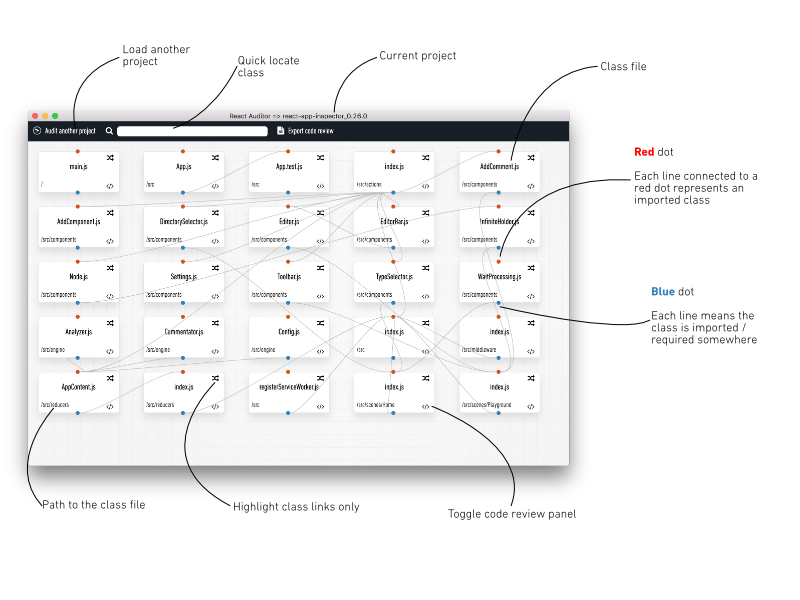
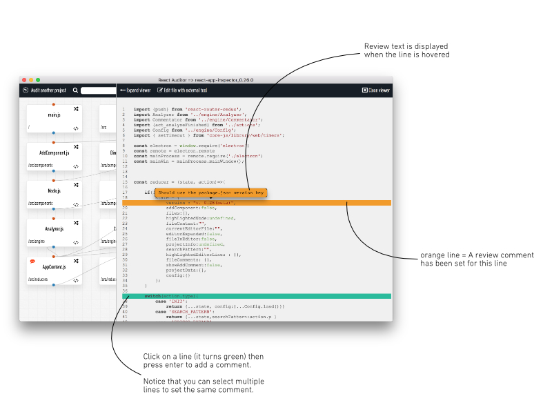

# Download
[Mac & Windows releases](https://github.com/GuillaumeNachury/react-app-inspector/releases)

# How to use
* Launch the app
* Click on `Audit an existing project`
* Select the main `package.json`
* Edit the exclusion directory list (if needed)
* Enter your reviewer name
* Click `Start analysis`
* Have fun 

## Your playground

The playground provides an overview of the project classes dependencies so you can quickly check the __code complexity__, __bottlenecks__, make __impact analysis__ or do __code reviews__.

### Main features

### Code viewer

#### Export
You can export the code review by clicking on the _Export code review_ button from the header bar. It will generate a (ugly) Markdow file.
Don't forget to set your reviewer name befor exporting.

## Hack it
You can hack this tool to improve / fix bugs / for fun and create your own build : https://github.com/GuillaumeNachury/react-app-inspector/

## Road map
This is still a beta version and new version may follow. So if you have good features / improvements ideas, drop me a message.

If you are ever on Twitter come and say hi : @__Guillaume